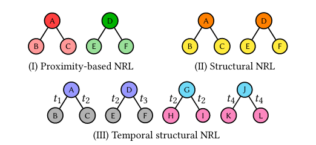

# Temporal SIR-GN


This repository provides a reference implementation of **Temporal SIR-GN** as described in the paper:

    Temporal SIR-GN: Efficient and Effective Structural Representation Learning for Temporal Graphs

Janet Layne, Justin Carpenter, Edoardo Serra, and Francesco Gullo.

<p align="center"></p>


The Temporal SIR-GN algorithm generates structural node representations for an undirected, temporal graph. These representations capture the evolution of each node's structure over time. 

## Citation
If you find Temporal SIR-GN useful for your research, please consider citing the following paper: NOTE, TO BE DETERMINED
```bibtex
@inproceedings{layne2023tempsirgn,
	title={Temporal SIR-GN: Efficient and Effective Structural Representation Learning for Temporal Graphs},
	author={Layne, Janet, Carpenter, Justin, Serra, Edoardo, and Gullo, Francesco},
	year={2023}
}
```

## Environment
Required packages: pandas, numpy, scikitlearn, scipy
```bash
pip install pandas numpy scipy scikit-learn

```  
Alternatively, create an environment with these requirements:
```bash
conda create -n my-env
conda activate my-env
# If you want to install from conda-forge
conda config --env --add channels conda-forge
# The actual install command
conda install pandas numpy scipy scikit-learn

```


## Usage

### Undirected Graphs

From the command line:
```bash
python temporalSirgn.py --input --output --stop --depth --alpha --clusters  
``` 

For example:


```bash
python temporalSirgn.py --input filename --output filename --stop --depth 5 --alpha 10 --clusters 10 
```  

### Directed Graphs

From the command line:
```bash
python directed_temporalSirgn.py --input --output --stop --depth --alpha --clusters  
``` 

For example:


```bash
python directed_temporalSirgn.py --input filename --output filename --stop --depth 5 --alpha 10 --clusters 10 
```  

### Input
Temporal SIR-GN takes in a comma separated edgelist (with header) in the form of <br>
```bash
nodeID1, nodeID2, timestamp
```

### Output

Output will be a comma separated text file of shape *n x k=(c^2+c)* for an (undirected) graph with *n* vertices, where *c* is the number of clusters chosen, formatted as follows: <br>
	
	nodeID, dim0, dim1, dim2,...,dimk


## Datasets
Undirected datasets do not have a reverse edge, however, the preprocessing from loader.py generates an adjacency list with a reverse edge. Datasets are of the form:<br>
```bash

nodeID1, nodeID2, timestamp

```

with header:<br>

    src, trg, time

The table below gives the recommended hyperparameters for each dataset used in node classification tasks

| Dataset   | Alpha    | Clusters | Depth |
|-------------|---------------------------------------------------------------------------|----------------|------------|
| synth_0.0     | 10 |    10   |   convergence (stop = True)    |
| synth_0.1  | 10 | 10     | convergence (stop = True)   |
| synth_0.2  | 10 |  10  |     convergence (stop = True)  |
| synth_0.3  |  10 |  10 |   convergence (stop = True) |
| BrazilAir |   1  |   10     |    convergence (stop = True)  |
| EUAir| 10 |   10   | convergence (stop = True)  |
| USAir   |  10 |    10     |   convergence (stop = True)  |
| DPPIN Tarrasov   | 1E4   | 10   | convergence (stop = True)   |
| High School   | 1E-8  | 10  | convergence (stop = True)   |
| Hospital   | 1E5 | 10 | convergence (stop = True)   |
| Bitcoin OTC (directed) | 1E6 | 11 | convergence (stop = True) |
|GDELT   | 1 | 10 | convergence (stop = True)

Note that BrazilAir, EUAir, USAir, and AS are too large for Github, and thus can be found in the following public Google Drive: <br>

https://drive.google.com/drive/folders/1a5uI6lIEBR3oUUU586ZQM-nJCb8pZkpg?usp=sharing

For the extremely large GDELT dataset, we refer to the AWS S3 bucket download instructions available here: https://github.com/amazon-science/tgl
